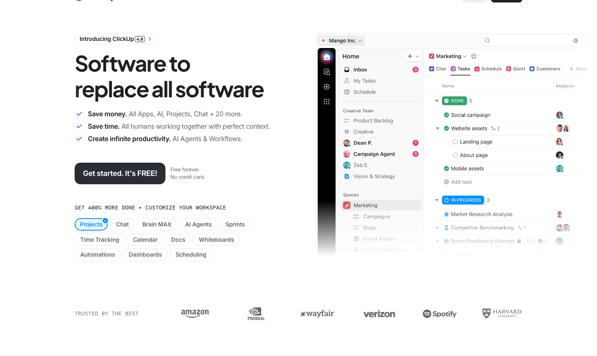
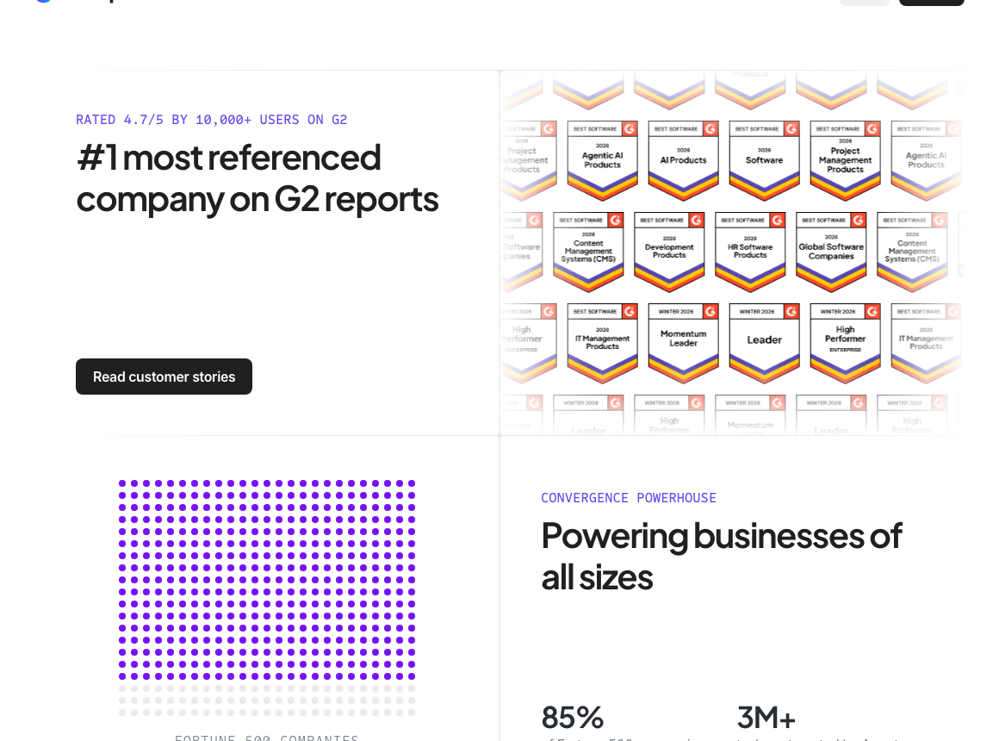
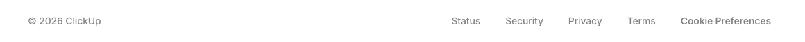

# Replicate brief — ClickUp™ | Maximize productivity • Software, AI, and humans converge

Source: `https://clickup.com/`
Captured: 2026-05-05T12:01:29.020Z
Viewport: 1440×900

## How to use this brief

1. Open `screenshots/full.png` and `screenshots/viewport.png`.
2. Skim `regions/` — each crop is annotated with its computed styles in the matching `.json`.
3. Read `tokens.json` for the inferred color / type / spacing scales.
4. Build code that recreates the layout. Stay faithful to the tokens.
5. When done, run `scry compare <yourUrl> <thisDir>` to verify parity.

## Inferred tokens

```json
{
  "capturedAt": "2026-05-05T12:01:18.052Z",
  "pageStats": {
    "elementsSampled": 2816
  },
  "colors": {
    "palette": [
      "#292d34",
      "#202020",
      "#646464",
      "#e9ebf0",
      "#7612fa",
      "#000000",
      "#838383",
      "#090c1d",
      "#7b68ee",
      "#ffffff",
      "#e8e8e8",
      "#7b7b7b",
      "#d9d9d9",
      "#eeeeee",
      "#0091ff",
      "#6647f0"
    ],
    "byCount": {
      "#292d34": 10541,
      "#202020": 886,
      "#646464": 613,
      "#e9ebf0": 500,
      "#7612fa": 426,
      "#000000": 370,
      "#838383": 359,
      "#090c1d": 250,
      "#7b68ee": 247,
      "#ffffff": 229,
      "#e8e8e8": 146,
      "#7b7b7b": 65,
      "#d9d9d9": 44,
      "#eeeeee": 40,
      "#0091ff": 35,
      "#6647f0": 30
    },
    "byRole": {
      "text": {
        "#292d34": 2167,
        "#202020": 176,
        "#646464": 136,
        "#000000": 76,
        "#838383": 72,
        "#7b68ee": 51,
        "#090c1d": 50,
        "#ffffff": 28
      },
      "background": {
        "#e9ebf0": 500,
        "#7612fa": 426,
        "#ffffff": 89,
        "#202020": 6,
        "#e8e8e8": 4,
        "#f0f0f0": 2,
        "#edf6fd": 2,
        "#000000": 2
      },
      "border": {
        "#292d34": 8373,
        "#202020": 704,
        "#646464": 476,
        "#000000": 292,
        "#838383": 287,
        "#090c1d": 200,
        "#7b68ee": 196,
        "#e8e8e8": 142
      }
    },
    "semantic": {
      "bg": "#e9ebf0",
      "fg": "#292d34",
      "accent": "#7612fa"
    }
  },
  "typography": {
    "fontFamilies": [
      "Plus Jakarta Sans",
      "Inter",
      "Sometype Mono"
    ],
    "scale": [
      "8px",
      "12px",
      "14px",
      "16px",
      "18px",
      "26px",
      "34px",
      "40px",
      "48px",
      "52px",
      "60px",
      "76px"
    ],
    "weights": [
      "400",
      "700",
      "500",
      "600",
      "650",
      "800"
    ],
    "lineHeights": [
      "14px",
      "18px",
      "20px",
      "21px",
      "22px",
      "24px"
    ]
  },
  "spacing": {
    "paddings": [
      "3px",
      "4px",
      "8px",
      "9px",
      "10px",
      "12px",
      "14px",
      "20px",
      "40px",
      "64px",
      "80px",
      "100px",
      "128px"
    ],
    "gaps": [
      "4px",
      "6px",
      "8px",
      "10px",
      "12px",
      "16px",
      "20px",
      "24px"
    ],
    "margins": [
      "-8px",
      "-4px",
      "5px",
      "10px",
      "16px",
      "24px",
      "30px",
      "48px",
      "140px",
      "160px",
      "180px",
      "226px",
      "340px",
      "720px"
    ]
  },
  "radii": [
    "0px",
    "8px",
    "9px",
    "12px",
    "14px",
    "16px",
    "54px",
    "653px"
  ],
  "shadows": [
    "rgba(0, 0, 0, 0.1) 0px 1px 3px 0px, rgba(0, 0, 0, 0.1) 0px 1px 2px -1px",
    "rgba(255, 255, 255, 0.08) 0px -32px 64px 0px inset, rgba(255, 255, 255, 0.08) 0px -32px 64px 0px inset",
    "rgba(18, 43, 165, 0.04) 0px 1px 1px -0.5px, rgba(18, 43, 165, 0.04) 0px 3px 3px -1.5px, rgba(18, 43, 165, 0.04) 0px 6px 6px -3px, rgba(18, 43, 165, 0.04) 0px 12px 12px -6px",
    "rgba(13, 21, 48, 0.04) 0px 4px 4px 0px",
    "rgba(255, 255, 255, 0.08) 0px -32px 64px 0px inset",
    "rgba(0, 0, 0, 0.3) 0px 8px 16px -4px, rgba(0, 0, 0, 0.2) 0px 4px 8px -2px, rgba(255, 255, 255, 0.1) 0px 1px 0px 0px inset"
  ]
}
```

## Regions

### 00 — `nav` (1440×60)


**Computed styles (excerpt):**

```json
{
  "display": "block",
  "flex": "row",
  "gap": "normal",
  "padding": "0px",
  "background": "rgba(0, 0, 0, 0)",
  "color": "rgb(41, 45, 52)",
  "fontFamily": "\"Plus Jakarta Sans\", sans-serif",
  "fontSize": "16px",
  "borderRadius": "0px",
  "boxShadow": "none"
}
```

> Brain AI Product Solutions Learn Pricing Enterprise Get a Demo Login Sign Up

### 01 — `main` (1440×11082)



**Computed styles (excerpt):**

```json
{
  "display": "block",
  "flex": "row",
  "gap": "normal",
  "padding": "0px",
  "background": "rgb(255, 255, 255)",
  "color": "rgb(41, 45, 52)",
  "fontFamily": "\"Plus Jakarta Sans\", sans-serif",
  "fontSize": "16px",
  "borderRadius": "0px",
  "boxShadow": "none"
}
```

> NEW AI Super Agents Software to replace all software Save money. All Apps, AI, Projects, Chat + 20 more. Save time. All humans working together with perfect context. Create infinit

### 02 — `section._wrapper_xe9jl_40` (1160×1017)



**Computed styles (excerpt):**

```json
{
  "display": "block",
  "flex": "row",
  "gap": "normal",
  "padding": "80px 0px",
  "background": "rgba(0, 0, 0, 0)",
  "color": "rgb(41, 45, 52)",
  "fontFamily": "\"Plus Jakarta Sans\", sans-serif",
  "fontSize": "16px",
  "borderRadius": "0px",
  "boxShadow": "none"
}
```

> Rated 4.7/5 by 10,000+ users on G2 #1 most referenced company on G2 reports Read customer stories Convergence powerhouse Powering businesses of all sizes 85% of Fortune 500 compani

### 03 — `footer` (1160×62)



**Computed styles (excerpt):**

```json
{
  "display": "block",
  "flex": "row",
  "gap": "normal",
  "padding": "12px 40px",
  "background": "rgba(0, 0, 0, 0)",
  "color": "rgb(41, 45, 52)",
  "fontFamily": "\"Plus Jakarta Sans\", sans-serif",
  "fontSize": "16px",
  "borderRadius": "0px",
  "boxShadow": "none"
}
```

> © 2026 ClickUp Status Security Privacy Terms Cookie Preferences
