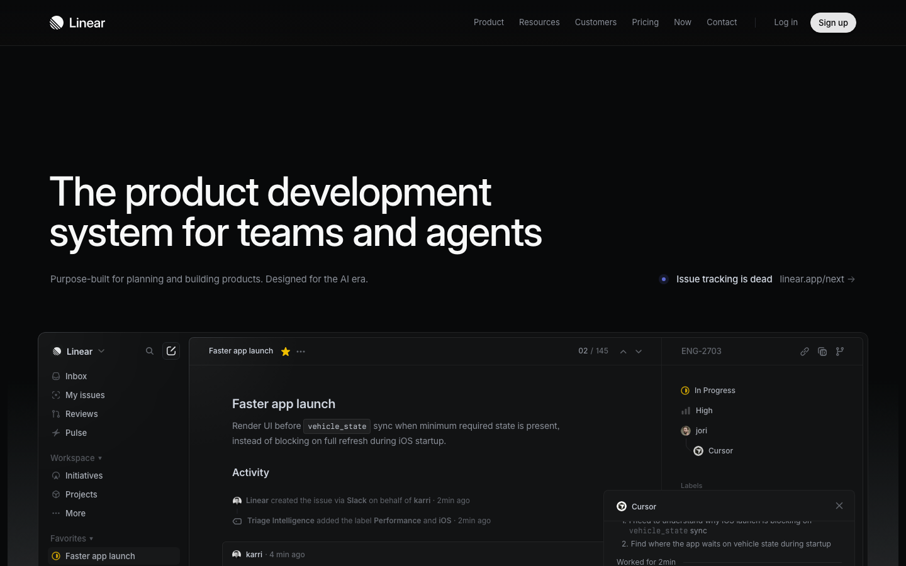
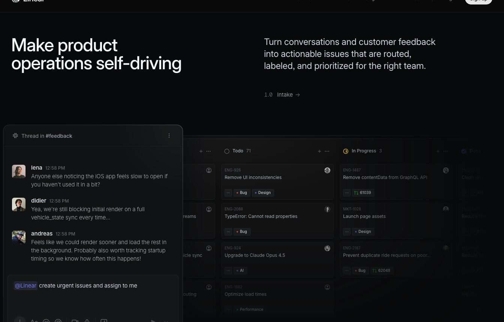
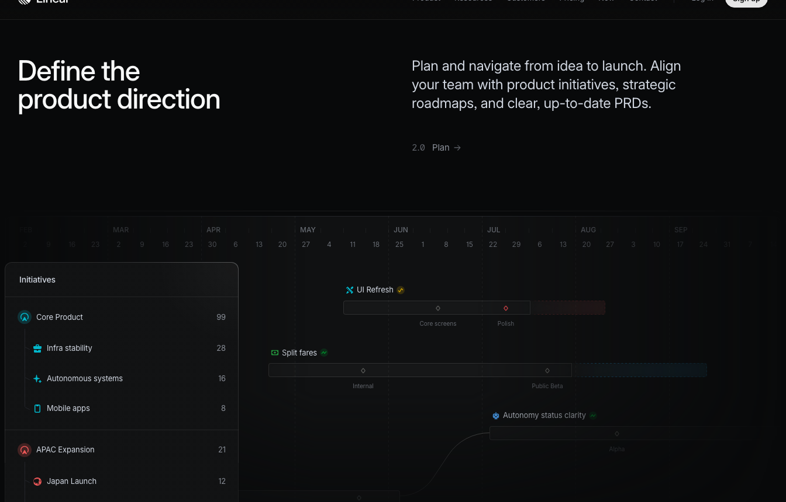
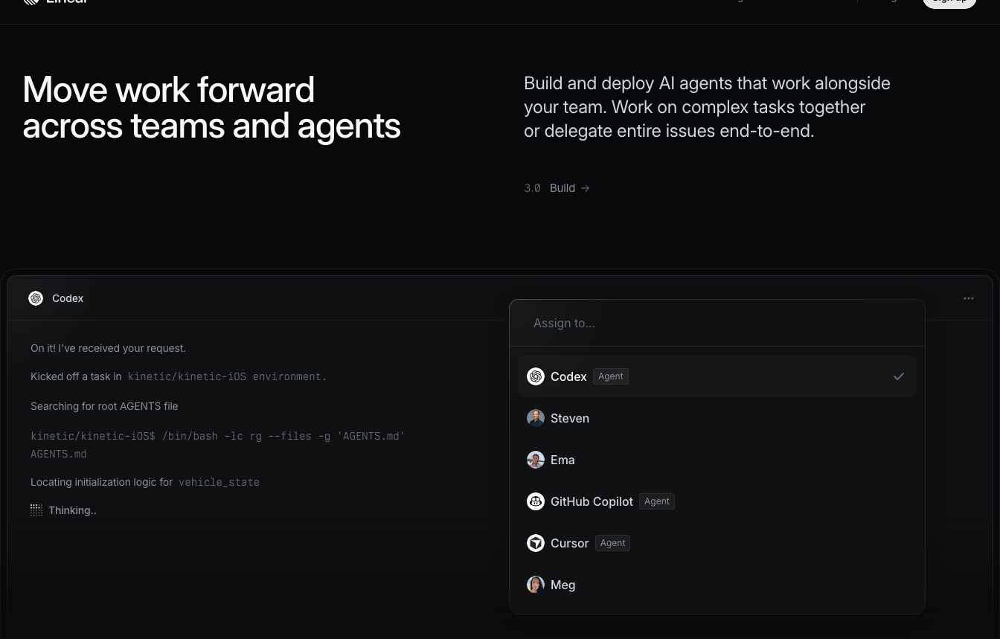
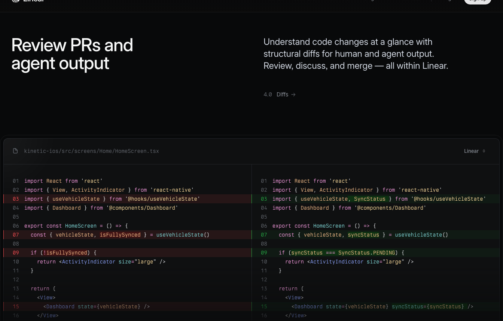
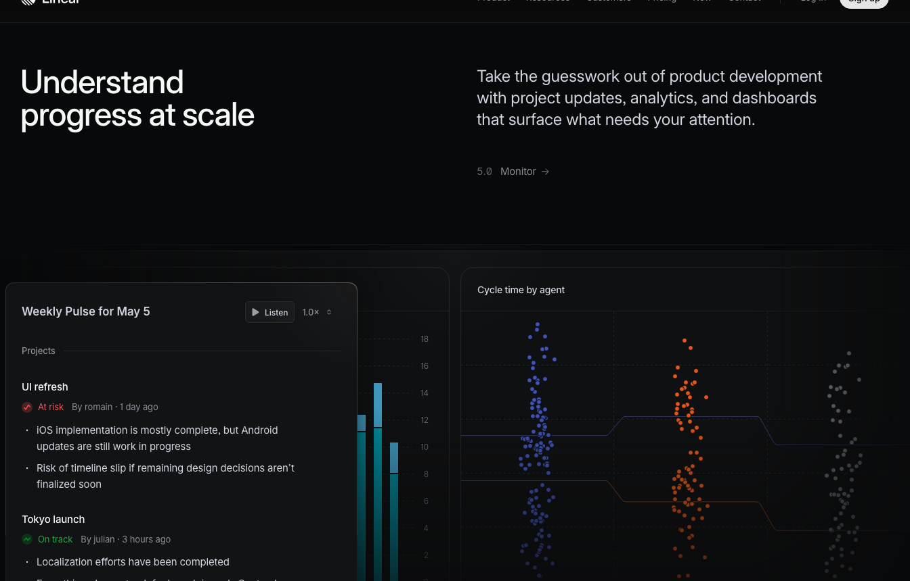
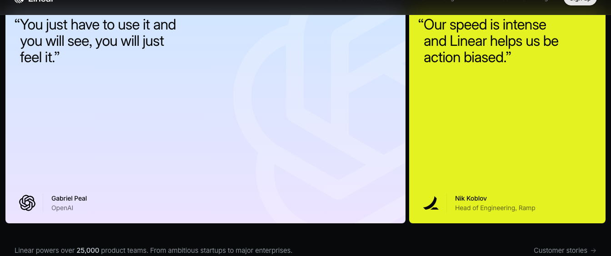
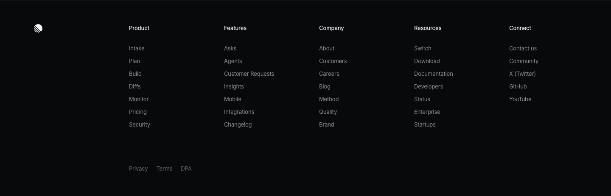

# Replicate brief — Linear – The system for product development

Source: `https://linear.app/`
Captured: 2026-05-05T11:58:36.815Z
Viewport: 1440×900

## How to use this brief

1. Open `screenshots/full.png` and `screenshots/viewport.png`.
2. Skim `regions/` — each crop is annotated with its computed styles in the matching `.json`.
3. Read `tokens.json` for the inferred color / type / spacing scales.
4. Build code that recreates the layout. Stay faithful to the tokens.
5. When done, run `scry compare <yourUrl> <thisDir>` to verify parity.

## Inferred tokens

```json
{
  "capturedAt": "2026-05-05T11:58:29.025Z",
  "pageStats": {
    "elementsSampled": 2096
  },
  "colors": {
    "palette": [
      "#f7f8f8",
      "#62666d",
      "#d0d6e0",
      "#8a8f98",
      "#e2e4e7",
      "#ffffff",
      "#ffffff@0.05",
      "#f79ce0",
      "#f7bf8b",
      "#ffffff@0.08",
      "#ffdf9f",
      "#83dcdc",
      "#8fa6ff",
      "#08090a",
      "#5e6ad2",
      "#23252a"
    ],
    "byCount": {
      "#f7f8f8": 5293,
      "#62666d": 1551,
      "#d0d6e0": 804,
      "#8a8f98": 658,
      "#e2e4e7": 596,
      "#ffffff": 535,
      "#ffffff@0.05": 242,
      "#f79ce0": 205,
      "#f7bf8b": 110,
      "#ffffff@0.08": 77,
      "#ffdf9f": 50,
      "#83dcdc": 45,
      "#8fa6ff": 40,
      "#08090a": 38,
      "#5e6ad2": 30,
      "#23252a": 18
    },
    "byRole": {
      "text": {
        "#f7f8f8": 1106,
        "#62666d": 323,
        "#d0d6e0": 172,
        "#8a8f98": 134,
        "#e2e4e7": 120,
        "#ffffff": 107,
        "#f79ce0": 41,
        "#f7bf8b": 22
      },
      "background": {
        "#08090a": 530,
        "#ffffff@0.05": 38,
        "#00ff05@0.10": 16,
        "#0f1011": 6,
        "#6366f1": 5,
        "#f34e52@0.10": 4,
        "#27a644@0.07": 4,
        "#eb5757": 3
      },
      "border": {
        "#f7f8f8": 4187,
        "#62666d": 1228,
        "#d0d6e0": 632,
        "#8a8f98": 524,
        "#e2e4e7": 476,
        "#ffffff": 428,
        "#ffffff@0.05": 204,
        "#f79ce0": 164
      }
    },
    "semantic": {
      "bg": "#08090a",
      "fg": "#f7f8f8",
      "accent": "#5e6ad2"
    }
  },
  "typography": {
    "fontFamilies": [
      "Inter Variable",
      "Berkeley Mono"
    ],
    "scale": [
      "10px",
      "12px",
      "13px",
      "14px",
      "15px",
      "16px",
      "24px",
      "32px",
      "48px",
      "64px",
      "72px"
    ],
    "weights": [
      "400",
      "510",
      "590",
      "300"
    ],
    "lineHeights": [
      "15px",
      "17px",
      "18px",
      "20px",
      "21px",
      "24px"
    ]
  },
  "spacing": {
    "paddings": [
      "1px",
      "2px",
      "6px",
      "8px",
      "12px",
      "16px",
      "20px",
      "24px",
      "32px",
      "96px",
      "128px",
      "156px",
      "212px",
      "385px"
    ],
    "gaps": [
      "2px",
      "3px",
      "4px",
      "6px",
      "8px",
      "12px",
      "15px",
      "16px"
    ],
    "margins": [
      "-16px",
      "-2px",
      "1px",
      "4px",
      "5px",
      "12px",
      "19px",
      "22px",
      "24px",
      "48px",
      "375px",
      "450px",
      "578px",
      "828px"
    ]
  },
  "radii": [
    "0px",
    "2px",
    "4px",
    "6px",
    "8px",
    "12px",
    "22px",
    "9999px"
  ],
  "shadows": [
    "rgba(0, 0, 0, 0.03) 0px 1.2px 0px 0px",
    "rgba(0, 0, 0, 0.4) 0px 2px 4px 0px",
    "rgba(0, 0, 0, 0.2) 0px 0px 12px 0px inset",
    "rgb(35, 37, 42) 0px 0px 0px 1px inset",
    "rgba(0, 0, 0, 0.2) 0px 0px 0px 1px",
    "rgba(8, 9, 10, 0.6) 0px 4px 32px 0px"
  ]
}
```

## Regions

### 00 — `header` (1440×73)


**Computed styles (excerpt):**

```json
{
  "display": "block",
  "flex": "row",
  "gap": "normal",
  "padding": "0px",
  "background": "rgba(0, 0, 0, 0)",
  "color": "rgb(247, 248, 248)",
  "fontFamily": "\"Inter Variable\", \"SF Pro Display\", -apple-system, \"system-ui\", \"Segoe UI\", Roboto, Oxygen, Ubuntu, Cantarell, \"Open Sans\", \"Helvetica Neue\", sans-serif",
  "fontSize": "16px",
  "borderRadius": "0px",
  "boxShadow": "none"
}
```

> Product Resources Customers Pricing Now Contact Docs Open app Log in Sign up

### 01 — `main` (1440×10317)



**Computed styles (excerpt):**

```json
{
  "display": "flex",
  "flex": "column",
  "gap": "normal",
  "padding": "72px 0px 0px",
  "background": "rgba(0, 0, 0, 0)",
  "color": "rgb(247, 248, 248)",
  "fontFamily": "\"Inter Variable\", \"SF Pro Display\", -apple-system, \"system-ui\", \"Segoe UI\", Roboto, Oxygen, Ubuntu, Cantarell, \"Open Sans\", \"Helvetica Neue\", sans-serif",
  "fontSize": "16px",
  "borderRadius": "0px",
  "boxShadow": "none"
}
```

> The product development system for teams and agents The product development system for teams and agents The product development system for teams and agents Purpose-built for planni

### 02 — `section.PageSection_root__kFVv1` (1344×1207)



**Computed styles (excerpt):**

```json
{
  "display": "block",
  "flex": "row",
  "gap": "normal",
  "padding": "96px 0px 128px",
  "background": "rgba(0, 0, 0, 0)",
  "color": "rgb(247, 248, 248)",
  "fontFamily": "\"Inter Variable\", \"SF Pro Display\", -apple-system, \"system-ui\", \"Segoe UI\", Roboto, Oxygen, Ubuntu, Cantarell, \"Open Sans\", \"Helvetica Neue\", sans-serif",
  "fontSize": "16px",
  "borderRadius": "0px",
  "boxShadow": "none"
}
```

> Make product operations self-driving Turn conversations and customer feedback into actionable issues that are routed, labeled, and prioritized for the right team. 1.0 Intake → Back

### 03 — `section.PageSection_root__kFVv1` (1344×1199)



**Computed styles (excerpt):**

```json
{
  "display": "block",
  "flex": "row",
  "gap": "normal",
  "padding": "96px 0px 128px",
  "background": "rgba(0, 0, 0, 0)",
  "color": "rgb(247, 248, 248)",
  "fontFamily": "\"Inter Variable\", \"SF Pro Display\", -apple-system, \"system-ui\", \"Segoe UI\", Roboto, Oxygen, Ubuntu, Cantarell, \"Open Sans\", \"Helvetica Neue\", sans-serif",
  "fontSize": "16px",
  "borderRadius": "0px",
  "boxShadow": "none"
}
```

> Define the product direction Plan and navigate from idea to launch. Align your team with product initiatives, strategic roadmaps, and clear, up-to-date PRDs. 2.0 Plan → FEB MAR APR

### 04 — `section.PageSection_root__kFVv1` (1344×1155)



**Computed styles (excerpt):**

```json
{
  "display": "block",
  "flex": "row",
  "gap": "normal",
  "padding": "96px 0px 128px",
  "background": "rgba(0, 0, 0, 0)",
  "color": "rgb(247, 248, 248)",
  "fontFamily": "\"Inter Variable\", \"SF Pro Display\", -apple-system, \"system-ui\", \"Segoe UI\", Roboto, Oxygen, Ubuntu, Cantarell, \"Open Sans\", \"Helvetica Neue\", sans-serif",
  "fontSize": "16px",
  "borderRadius": "0px",
  "boxShadow": "none"
}
```

> Move work forward across teams and agents Build and deploy AI agents that work alongside your team. Work on complex tasks together or delegate entire issues end-to-end. 3.0 Build →

### 05 — `section.PageSection_root__kFVv1` (1344×1073)



**Computed styles (excerpt):**

```json
{
  "display": "block",
  "flex": "row",
  "gap": "normal",
  "padding": "96px 0px 128px",
  "background": "rgba(0, 0, 0, 0)",
  "color": "rgb(247, 248, 248)",
  "fontFamily": "\"Inter Variable\", \"SF Pro Display\", -apple-system, \"system-ui\", \"Segoe UI\", Roboto, Oxygen, Ubuntu, Cantarell, \"Open Sans\", \"Helvetica Neue\", sans-serif",
  "fontSize": "16px",
  "borderRadius": "0px",
  "boxShadow": "none"
}
```

> Review PRs and agent output Understand code changes at a glance with structural diffs for human and agent output. Review, discuss, and merge — all within Linear. 4.0 Diffs → kineti

### 06 — `section.PageSection_root__kFVv1` (1344×1179)



**Computed styles (excerpt):**

```json
{
  "display": "block",
  "flex": "row",
  "gap": "normal",
  "padding": "96px 0px 128px",
  "background": "rgba(0, 0, 0, 0)",
  "color": "rgb(247, 248, 248)",
  "fontFamily": "\"Inter Variable\", \"SF Pro Display\", -apple-system, \"system-ui\", \"Segoe UI\", Roboto, Oxygen, Ubuntu, Cantarell, \"Open Sans\", \"Helvetica Neue\", sans-serif",
  "fontSize": "16px",
  "borderRadius": "0px",
  "boxShadow": "none"
}
```

> Understand progress at scale Take the guesswork out of product development with project updates, analytics, and dashboards that surface what needs your attention. 5.0 Monitor → Iss

### 07 — `section#customers` (1344×564)



**Computed styles (excerpt):**

```json
{
  "display": "block",
  "flex": "row",
  "gap": "normal",
  "padding": "0px",
  "background": "rgba(0, 0, 0, 0)",
  "color": "rgb(247, 248, 248)",
  "fontFamily": "\"Inter Variable\", \"SF Pro Display\", -apple-system, \"system-ui\", \"Segoe UI\", Roboto, Oxygen, Ubuntu, Cantarell, \"Open Sans\", \"Helvetica Neue\", sans-serif",
  "fontSize": "16px",
  "borderRadius": "0px",
  "boxShadow": "none"
}
```

> You just have to use it and you will see, you will just feel it. Gabriel Peal OpenAI Our speed is intense and Linear helps us be action biased. Nik Koblov Head of Engineering, Ramp

### 08 — `section.CTA_homepagePrefooter__FWdih` (1344×228)


**Computed styles (excerpt):**

```json
{
  "display": "flex",
  "flex": "column",
  "gap": "40px",
  "padding": "0px",
  "background": "rgba(0, 0, 0, 0)",
  "color": "rgb(247, 248, 248)",
  "fontFamily": "\"Inter Variable\", \"SF Pro Display\", -apple-system, \"system-ui\", \"Segoe UI\", Roboto, Oxygen, Ubuntu, Cantarell, \"Open Sans\", \"Helvetica Neue\", sans-serif",
  "fontSize": "16px",
  "borderRadius": "0px",
  "boxShadow": "none"
}
```

> Built for the future. Available today. Get started Contact sales Open app Download

### 09 — `footer` (1440×464)



**Computed styles (excerpt):**

```json
{
  "display": "block",
  "flex": "row",
  "gap": "normal",
  "padding": "0px",
  "background": "rgb(8, 9, 10)",
  "color": "rgb(247, 248, 248)",
  "fontFamily": "\"Inter Variable\", \"SF Pro Display\", -apple-system, \"system-ui\", \"Segoe UI\", Roboto, Oxygen, Ubuntu, Cantarell, \"Open Sans\", \"Helvetica Neue\", sans-serif",
  "fontSize": "16px",
  "borderRadius": "0px",
  "boxShadow": "none"
}
```

> Product Intake Plan Build Diffs Monitor Pricing Security Features Asks Agents Customer Requests Insights Mobile Integrations Changelog Company About Customers Careers Blog Method Q
